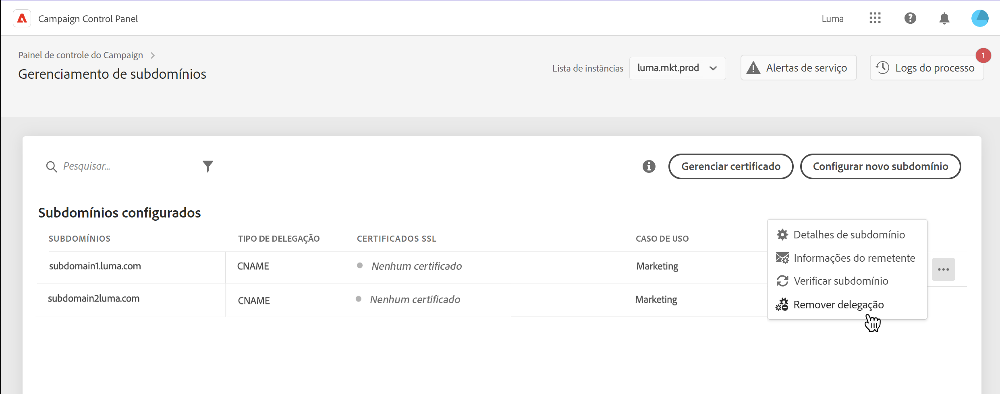
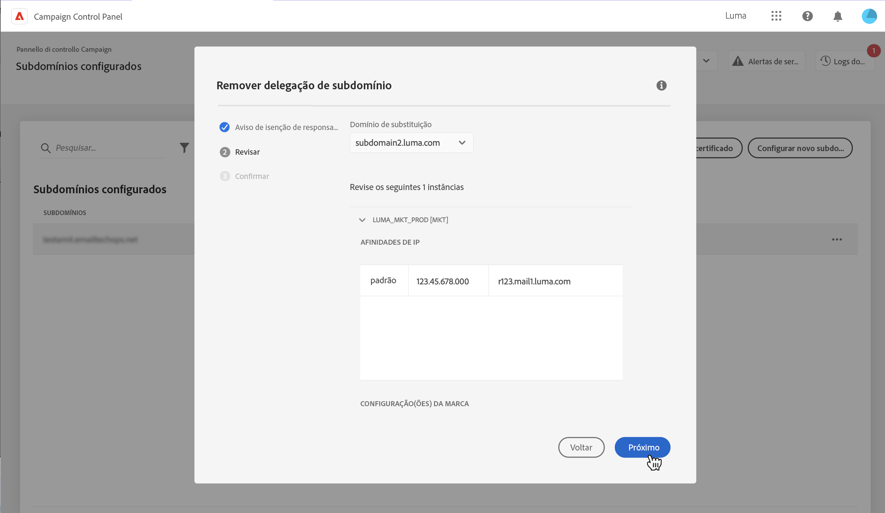
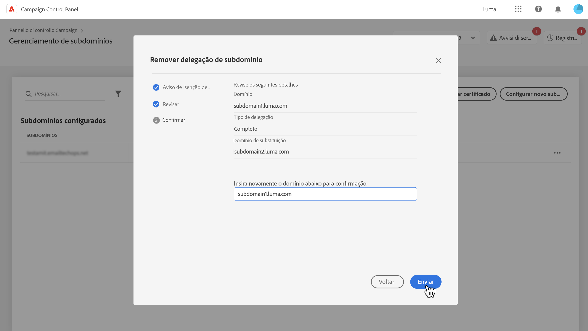
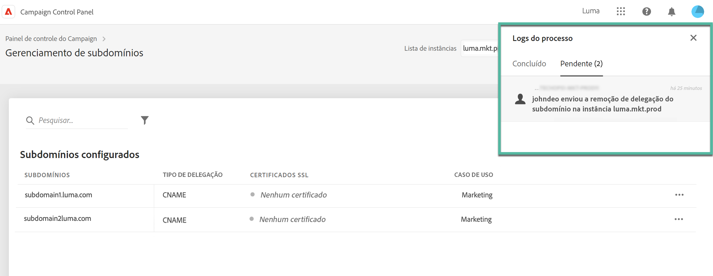
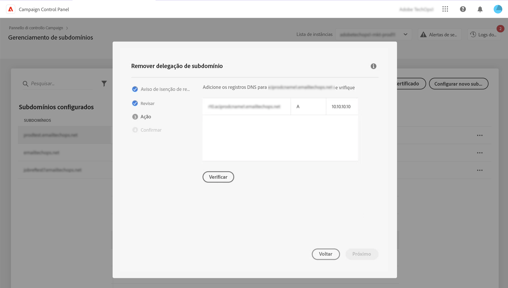

# Remover delegação de subdomínios para a Adobe {#remove-delegated--subdomains}

>[!CONTEXTUALHELP]
>id="cp_subdomain_undelegate"
>title="Remover delegação de subdomínio"
>abstract="Essa tela permite remover a delegação de um subdomínio para a Adobe. Lembre-se de que esse processo não pode ser desfeito e é irreversível até que sua execução seja concluída.  Se estiver tentando remover a delegação de um domínio principal para a instância selecionada, você deverá escolher o domínio que a substituirá."

O Painel de controle do Campaign permite remover a delegação de um subdomínio que foi totalmente delegado ao Adobe ou delegado usando CNAMEs.

## Observações importantes {#important}

Antes de continuar, considere cuidadosamente os impactos que ocorrem assim que o processo de remoção é acionado:

* Depois que o processo é acionado, a remoção da delegação de subdomínio não pode ser desfeita e é irreversível até que a execução do processo seja concluída.
* Nenhuma outra delegação de subdomínio pode ser removida quando um processo semelhante em outro subdomínio estiver em andamento.
* Uma delegação removida em um subdomínio não pode ser delegada novamente até 3 dias após sua remoção.

## Remover uma delegação de subdomínio {#steps}

Para remover a delegação de um subdomínio para a Adobe, siga estas etapas:

1. Clique no botão de reticências ao lado da delegação de domínio que deseja remover e selecione **[!UICONTROL Remove delegated subdomain]**.

   

1. Revise o aviso e confirme a remoção da delegação de domínio para a Adobe.

1. Revise as informações sobre a instância à qual o subdomínio está associado, incluindo afinidades de IP relacionadas e configurações de marca.

   Se você estiver removendo a delegação do domínio primário para a instância selecionada, será necessário escolher o domínio que a substituirá usando a lista de **[!UICONTROL Replacement Domain]**.

   Clique em **[!UICONTROL Next]** para prosseguir com a remoção.

   

1. Se você estiver removendo uma delegação do tipo CNAME ou se estiver substituindo um domínio primário por um domínio delegado usando CNAMEs, uma **[!UICONTROL Action]** é exibida para gerenciar registros DNS. [Saiba mais nesta seção](#dns)

1. Revise o resumo exibido. Para confirmar a remoção, digite o URL do domínio para o qual deseja remover a delegação e clique em **[!UICONTROL Submit]**.

   

Após iniciar a remoção da delegação, o processo pendente é exibido nos logs de processo até sua conclusão.

## Gerenciamento de registros DNS {#dns}

Para configurar uma delegação de domínio usando CNAMEs, o Painel de controle do Campaign requer a adição de registros específicos ao servidor DNS. [Saiba como configurar subdomínios usando CNAMEs](setting-up-new-subdomain.md#use-cnames)

Ao remover uma delegação do tipo CNAME, é necessário **remover estes registros DNS** do servidor para evitar qualquer problema. Além disso, se desejar remover a delegação de um subdomínio primário e substituí-lo por um domínio que foi delegado usando CNAMEs, talvez seja necessário **adicionar registros DNS** no servidor, dependendo das afinidades de IP definidas para o subdomínio.

A tabela abaixo lista as ações a serem executadas, dependendo do tipo de delegação que você está removendo e do tipo de delegação usado para configurar o domínio de substituição.

| Delegação removida | Delegação de domínio de substituição | Ação necessária |
|  ---  |  ---  |  ---  |
| CNAME | Nenhum domínio de substituição | Excluir registros DNS |
| CNAME | CNAME | Excluir registros DNS Adicionar registros DNS *(opcional, dependendo das afinidades de IP)* |
| CNAME | Completo | Excluir registros DNS |
| Completo | Nenhum domínio de substituição | Nenhuma ação necessária |
| Completo | CNAME | Adicionar registros DNS *(opcional, dependendo das afinidades de IP)* |
| Completo | Completo | Nenhuma ação necessária |

{style="table-layout:auto"}

Para fazer isso, um **[!DNL Action]** etapa é exibida antes de confirmar a remoção da delegação. Essa tela lista os registros DNS a serem removidos ou adicionados, dependendo do contexto.

### Excluir registros DNS

1. Navegue até o servidor DNS e remova os registros listados no Painel de controle do Campaign.
1. Volte para Painel de controle e clique em **[!UICONTROL Next]** para continuar com a remoção da delegação.

### Adicionar registros DNS

1. Navegue até o servidor DNS e adicione os registros listados no Painel de controle do Campaign.
1. Aguarde a adição de DNS entrar em vigor.
1. Volte para Painel de controle e clique em **[!UICONTROL Verify]**.
1. Depois que a adição dos registros for verificada com êxito, clique em **[!UICONTROL Next]** para continuar com a remoção da delegação.

## Códigos de erro {#FAQ}

Esta seção lista as mensagens de erro que você pode encontrar ao tentar remover a delegação de um subdomínio:

| Código de erro | Mensagem | Descrição |
|  ---  |  ---  |  ---  |
| 8002 | A remoção de domínio delegado solicitada não pode ser realizada porque já existe uma solicitação semelhante em andamento. Tente novamente após 3 dias | Um trabalho de remoção de delegação de subdomínio já está em processo para a instância selecionada. Aguarde até 3 dias para iniciar um novo processo de remoção. |
| 8003 | Não há suporte para a remoção de domínio delegado solicitada nesta instância. | Não há suporte para a remoção de delegação para o subdomínio selecionado devido a um problema técnico. Entre em contato com o Atendimento ao cliente. |
| 8004 | A remoção de domínio delegado solicitada não é permitida, pois há apenas um domínio nesta instância. | Somente um subdomínio foi delegado para a instância selecionada. A remoção de delegação não é permitida. |
| 8005 | Não há suporte para a remoção de domínio delegado solicitada nesta configuração. | Não há suporte para a remoção de delegação para o subdomínio selecionado devido a um problema técnico. Entre em contato com o Atendimento ao cliente. |
| 8006 | A remoção de domínio delegado solicitada não é permitida por motivos desconhecidos. Entre em contato com o Atendimento ao cliente. | Não há suporte para a remoção de delegação para a instância selecionada devido a problemas desconhecidos. Entre em contato com o Atendimento ao Cliente. |
