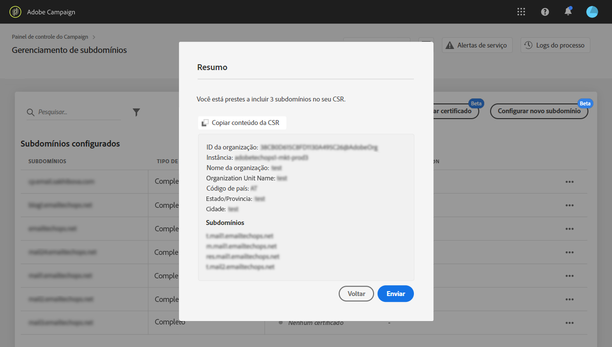
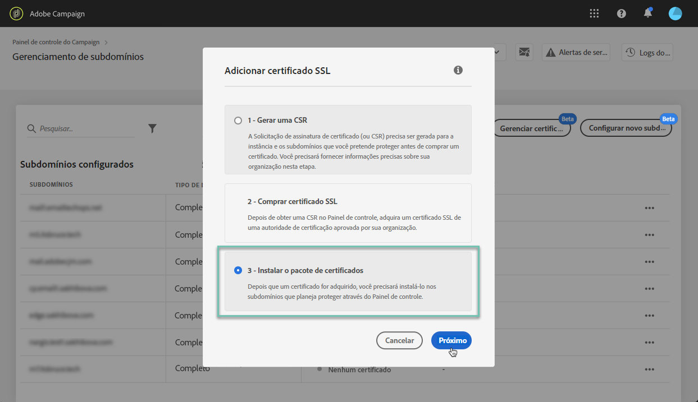

# Renovar certificados SSL {#renewing-subdomains-ssl-certificates}

>[!CONTEXTUALHELP]
>id="cp_add_ssl_certificate"
>title="Renovação do certificado SSL"
>abstract="Para renovar um certificado SSL, você precisa gerar uma CSR, comprar o certificado SSL para os subdomínios e instalar o Pacote de certificados. Essa operação só será necessária se você optar por gerenciar certificados manualmente em vez de delegá-los à Adobe. "

>[!NOTE]
>
>A renovação dos certificados SSL de seus subdomínios só é necessária se você optar por gerenciar certificados por conta própria em vez de delegar esse processo à Adobe. É altamente recomendado delegar o gerenciamento dos certificados SSL de seus subdomínios à Adobe, pois ela criará automaticamente o certificado e o renovará todos os anos antes da expiração. [Saiba mais sobre o gerenciamento de certificados SSL](monitoring-ssl-certificates.md#management)

O processo de renovação do certificado SSL inclui 3 etapas:

1. **Geração da Solicitação de assinatura de certificado (CSR)**

   A Solicitação de assinatura de certificado deve ser gerada para a instância e os subdomínios que você pretende proteger antes de adquirir um certificado.  Você precisará fornecer algumas informações necessárias para gerar a CSR (como Nome, Nome e endereço da organização etc.). [Saiba mais](#generate)

1. **Compra do certificado SSL**

   Depois que a CSR é gerada, você pode usá-la para comprar o certificado SSL da Autoridade de certificação que sua empresa aprova.

1. **Instalação do certificado SSL**

   Instale o certificado SSL adquirido no subdomínio desejado para protegê-los. [Saiba mais](#install)

 Descubra este recurso no vídeo usando o [Campaign v7/v8](https://experienceleague.adobe.com/docs/campaign-classic-learn/control-panel/subdomains-and-certificates/adding-ssl-certificates.html?lang=pt-BR#subdomains-and-certificates) ou o [Campaign Standard](https://experienceleague.adobe.com/docs/campaign-standard-learn/control-panel/subdomains-and-certificates/adding-ssl-certificates.html?lang=pt-BR#adding-ssl-certificates)

**Tópicos relacionados:**

* [Manual de práticas recomendadas de entrega - processo de solicitação de certificado SSL para Adobe Campaign](https://experienceleague.adobe.com/docs/deliverability-learn/deliverability-best-practice-guide/additional-resources/campaign/ac-ssl-certificate-request.html?lang=pt-BR)
* [Marca de subdomínios](../../subdomains-certificates/using/subdomains-branding.md)
* [Monitoramento de subdomínios](../../subdomains-certificates/using/monitoring-subdomains.md)

## Gerar a CSR {#generate}

>[!CONTEXTUALHELP]
>id="cp_generate_csr"
>title="Geração de CSR"
>abstract="A Solicitação de assinatura de certificado deve ser gerada para a instância e os subdomínios que você pretende proteger antes de adquirir um certificado."

>[!CONTEXTUALHELP]
>id="cp_select_subdomains"
>title="Selecione os subdomínios para sua CSR"
>abstract="Você pode optar por incluir todos ou somente subdomínios específicos na solicitação de assinatura de certificado. Somente os subdomínios selecionados serão certificados por meio do certificado SSL adquirido."

Para gerar uma Solicitação de assinatura de certificado (CSR), siga estas etapas:

1. No cartão **[!UICONTROL Subdomains & Certificates]**, selecione a instância desejada e clique no botão **[!UICONTROL Manage Certificate]**.

   

1. Selecione **[!UICONTROL 1 - Generate a CSR]** e clique em **[!UICONTROL Next]** para iniciar o assistente que guiará você pelo processo de geração de CSR.

   

1. Um formulário é exibido com todos os detalhes necessários para gerar a CSR.

   Preencha as informações solicitadas completamente e com precisão, caso contrário, o certificado pode não ser renovado (entre em contato com a equipe interna, as equipes de segurança e de TI, se necessário) e clique em **[!UICONTROL Next]**.

   * **[!UICONTROL Organization]**: nome oficial da organização.
   * **[!UICONTROL Organization Unit]**: unidade vinculada ao subdomínio (por exemplo: Marketing, TI).
   * **[!UICONTROL Instance]** (pré-preenchido): URL da instância do Campaign associado ao subdomínio.
   * **[!UICONTROL Common name]**: o nome comum é selecionado por padrão. Você pode selecionar um dos subdomínios se necessário.

   

1. Selecione os subdomínios que serão incluídos na CSR e clique em **[!UICONTROL OK]**.

   

1. Os subdomínios selecionados são exibidos na lista. Para cada um deles, selecione os subdomínios que serão incluídos e clique em **[!UICONTROL Next]**.

   

1. Um resumo dos subdomínios que serão incluídos na CSR é exibido. Clique em **[!UICONTROL Submit]** para confirmar a solicitação.

   

   >[!NOTE]
   >
   >O botão **[!UICONTROL Copy CSR content]** permite copiar todas as informações relacionadas à CSR (ID da organização, instância, nome da organização, nome comum, subdomínios incluídos etc.)

1. O arquivo .csr correspondente à seleção é gerado e baixado automaticamente. Agora você pode usá-lo para adquirir o certificado SSL da autoridade de certificação que sua empresa aprovar. Se precisar baixar a CSR novamente, siga as etapas detalhadas [nesta seção](#download).

Depois que a CSR for gerada e baixada, você poderá usá-la para comprar um certificado SSL de uma autoridade de certificação aprovada pela organização.

Depois que o certificado SSL for comprado, você poderá instalá-lo na instância para proteger seu subdomínio. [Saiba mais](#install)

## Baixar a CSR {#download}

Para comprar um certificado SSL, primeiro é necessário baixar a Solicitação de assinatura de certificado (CSR). A CSR é baixada automaticamente após ser gerada. Também é possível baixá-la novamente a qualquer momento em Logs de processo:

1. Em **[!UICONTROL Job Logs]**, clique na guia **[!UICONTROL Finished]** e filtre a lista para exibir os processos relacionados ao gerenciamento de subdomínios.

   

1. Abra o processo correspondente à geração da CSR e clique no link **[!UICONTROL Downbload]** para obter o arquivo .csr.

   

## Instalar o certificado SSL {#install}

>[!CONTEXTUALHELP]
>id="cp_install_ssl_certificate"
>title="Instalação do certificado SSL"
>abstract="Instale o certificado SSL adquirido da autoridade de certificação aprovada pela sua organização."

Depois que um certificado SSL for adquirido, você poderá instalá-lo em sua instância. Antes de continuar, verifique os pré-requisitos abaixo:

* A Solicitação de assinatura de certificado (CSR) deve ter sido gerada pelo Painel de controle. Caso contrário, você não poderá instalar o certificado pelo Painel de controle.
* A Solicitação de assinatura de certificado (CSR) deve corresponder ao subdomínio que foi configurado para funcionar com a Adobe. Por exemplo, ela não pode conter mais subdomínios do que o que foi configurado.
* O certificado deve ter uma data atual. Não é possível instalar certificados com datas futuras e eles não devem estar expirados (ou seja, datas de início e término devem ser válidas).
* O certificado deve ser emitido por uma autoridade de certificação (CA) confiável, como Comodo, DigiCert, Goaddy, etc.
* O tamanho do certificado deve ser de 2048 bits e o algoritmo deve ser RSA.
* O certificado deve estar no formato X.509 PEM.
* Os certificados SAN são compatíveis.
* Certificados curinga não são compatíveis.
* O arquivo ZIP ou o certificado não deve ser protegido por senha.
* De preferência, o arquivo ZIP deve conter apenas o seguinte em arquivos individuais:
   * Certificado de entidade final.
   * Cadeia intermediária de certificados (ordenada na ordem correta).
   * Certificado raiz (opcional).

Para instalar o certificado, siga estas etapas:

1. No cartão **[!UICONTROL Subdomains & Certificates]**, selecione a instância desejada e clique no botão **[!UICONTROL Manage Certificate]**.

   

1. Selecione **[!UICONTROL 3 - Install Certificate Bundle]** e clique em **[!UICONTROL Next]** para iniciar o assistente que guiará você pelo processo de instalação do certificado.

   

1. Selecione o arquivo .zip que contém o certificado que será instalado e clique em **[!UICONTROL Submit]**.

   

>[!NOTE]
>
>O certificado será instalado em todos os domínios/subdomínios incluídos na CSR. Nenhum domínio/subdomínio adicional presente no certificado será considerado.

Depois que o certificado SSL é instalado, a data de expiração e o ícone de status do certificado são devidamente atualizados.
