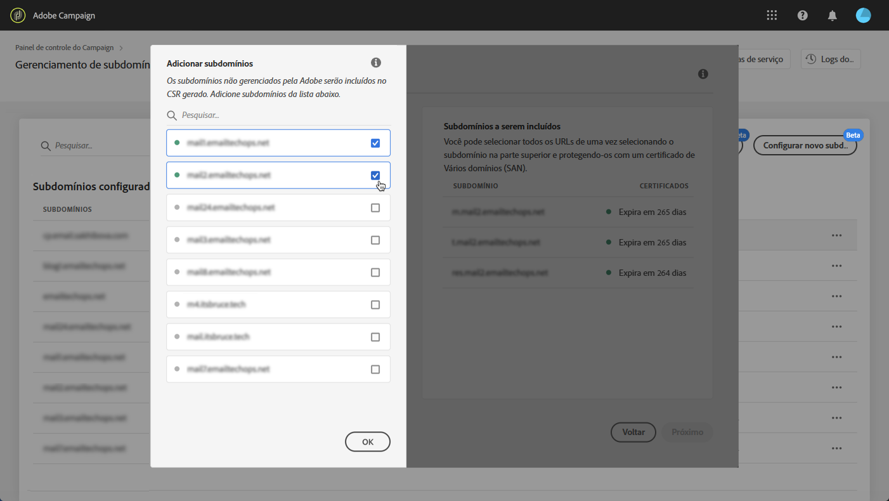

# Renovando um certificado SSL de subdomínio {#renewing-subdomains-ssl-certificates}

## Sobre a renovação de certificados {#about-certificate-renewal-process}

O processo de renovação do certificado SSL inclui 3 etapas, todas executadas diretamente do Painel de controle:

1. **Geração da Solicitação de assinatura de certificado (CSR)O Atendimento ao cliente da** Adobe gera um CSR para você. Será necessário fornecer algumas informações necessárias para gerar o CSR (como Nome comum, Nome da organização e endereço, etc.).
1. **Compra do certificado** SSL Depois que o CSR é gerado, você pode baixá-lo e usá-lo para comprar o certificado SSL da autoridade de certificação que sua empresa aprovar.
1. **Instalação do certificado** SSL Depois de comprar o certificado SSL, você pode instalá-lo no subdomínio desejado.

## Gerando uma solicitação de assinatura de certificado (CSR) {#generating-csr}

Para gerar uma solicitação de assinatura de certificado (CSR), siga estas etapas:

1. No **[!UICONTROL Subdomains & Certificates]**cartão, selecione a instância desejada e clique no**[!UICONTROL Manage Certificate]** botão.

   

1. Selecione **[!UICONTROL Generate a CSR]**e clique**[!UICONTROL Next]** para iniciar o assistente que o guiará pelo processo de geração de CSR.

   

1. Um formulário é exibido, com todos os detalhes necessários para gerar seu CSR.

   Preencha as informações solicitadas de forma completa e precisa (entre em contato com sua equipe interna, com as equipes de segurança e TI, se necessário) e clique em **[!UICONTROL Next]**.

   * **[!UICONTROL Organization]**:
   * **[!UICONTROL Organization Unit]**:
   * **[!UICONTROL Instance]**: URL da instância Campaign associada ao subdomínio.
   

1. Selecione os subdomínios a serem incluídos no CSR e clique em **[!UICONTROL OK]**.

   

1. Os subdomínios selecionados são exibidos na lista. Para cada um deles, selecione os subdomínios a serem incluídos e clique em **[!UICONTROL Next]**.

   

1. Um resumo dos subdomínios a serem incluídos no CSR é exibido. Clique em **[!UICONTROL Submit]**para confirmar sua solicitação.

   

1. O arquivo .csr correspondente à sua seleção é gerado e baixado automaticamente. Agora você pode usá-lo para adquirir o certificado SSL da Autoridade de certificação que sua empresa aprovar.

## Comprar um certificado com o CSR {#purchasing-certificate}

Depois de obter um CSR de Solicitação de assinatura de certificado do Painel de controle, adquira um certificado SSL de uma autoridade de certificação aprovada pela sua organização.

## Instalação do certificado SSL {#installing-ssl-certificate}

Depois que um certificado SSL for adquirido, siga estas etapas para instalá-lo em sua instância.

1. No **[!UICONTROL Subdomains & Certificates]**cartão, selecione a instância desejada e clique no**[!UICONTROL Manage Certificate]** botão.

   

1. Clique em **[!UICONTROL Install SSL Certificate]**, em seguida,**[!UICONTROL Next]** para iniciar o assistente que o guiará pelo processo de instalação do certificado.

   

1. Selecione o arquivo .zip que contém o certificado a ser instalado e clique em **[!UICONTROL Submit]**.

   
