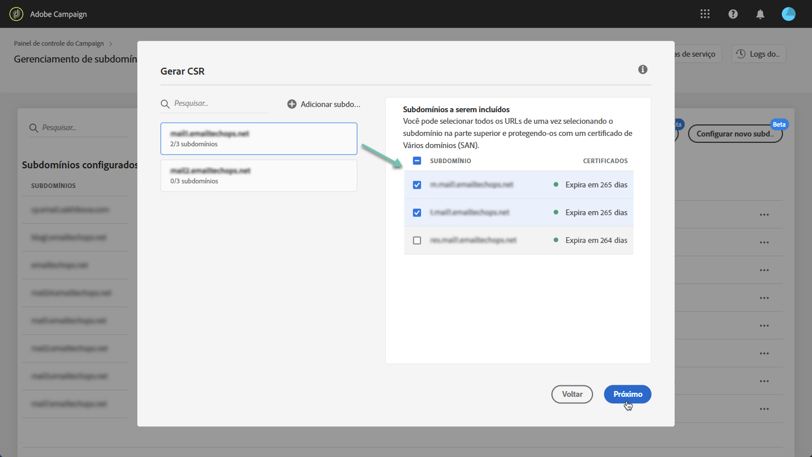

# Renovando um certificado SSL de subdomínio {#renewing-subdomains-ssl-certificates}

>[!CONTEXTUALHELP]
>id="cp_add_ssl_certificate"
>title="Adicionar certificado SSL"
>abstract="Para adicionar um certificado SSL, você precisa gerar um CSR, comprar o certificado SSL para seus subdomínios e instalar o Pacote de certificados."
>additional-url="https://docs.adobe.com/content/help/en/control-panel/using/subdomains-and-certificates/renewing-subdomain-certificate.html#generating-csr" text="Gerando uma solicitação de assinatura de certificado (CSR)"
>additional-url="https://docs.adobe.com/content/help/en/control-panel/using/subdomains-and-certificates/renewing-subdomain-certificate.html#installing-ssl-certificate" text="Como instalar um certificado SSL"

>[!IMPORTANT]
>
>A delegação de subdomínios do Painel de controle está disponível em beta e sujeita a atualizações e modificações frequentes sem aviso prévio.

## Sobre a renovação de certificados {#about-certificate-renewal-process}

O processo de renovação do certificado SSL inclui 3 etapas:

1. **Geração da Solicitação de assinatura de certificado (CSR)O Atendimento ao cliente da** Adobe gera um CSR para você. Você precisará fornecer algumas informações necessárias para gerar o CSR (como Nome comum, Nome da organização e endereço, etc.).
1. **Compra do certificado** SSL Depois que o CSR é gerado, você pode baixá-lo e usá-lo para comprar o certificado SSL da autoridade de certificação que sua empresa aprovar.
1. **Instalação do certificado** SSL Depois de comprar o certificado SSL, você pode instalá-lo no subdomínio desejado.

## Gerando uma solicitação de assinatura de certificado (CSR) {#generating-csr}

>[!CONTEXTUALHELP]
>id="cp_generate_csr"
>title="Gerar CSR"
>abstract="A Solicitação de assinatura de certificado deve ser gerada para a instância e os subdomínios que você pretende proteger antes de adquirir um certificado."

>[!CONTEXTUALHELP]
>id="cp_select_subdomains"
>title="Selecione os subdomínios para seu CSR"
>abstract="Você pode optar por incluir todos ou somente subdomínios específicos em sua Solicitação de assinatura de certificado. Somente os subdomínios selecionados serão certificados por meio do certificado SSL adquirido."
>additional-url="https://docs.adobe.com/content/help/en/control-panel/using/subdomains-and-certificates/renewing-subdomain-certificate.html#generating-csr" text="Gerando uma solicitação de assinatura de certificado (CSR)"
>additional-url="https://docs.adobe.com/content/help/pt-BR/control-panel/using/subdomains-and-certificates/subdomains-branding.html" text="Sobre a marca de subdomínios"

Para gerar uma solicitação de assinatura de certificado (CSR), siga estas etapas:

1. No **[!UICONTROL Subdomains & Certificates]** cartão, selecione a instância desejada e clique no **[!UICONTROL Manage Certificate]** botão.

   

1. Selecione **[!UICONTROL 1 - Generate a CSR]** e clique **[!UICONTROL Next]** para iniciar o assistente que o guiará pelo processo de geração de CSR.

   

1. Um formulário é exibido, com todos os detalhes necessários para gerar seu CSR.

   Certifique-se de preencher as informações solicitadas de forma completa e precisa; caso contrário, o certificado pode não ser renovado (entre em contato com a equipe interna, as equipes de segurança e TI, se necessário) e clique em **[!UICONTROL Next]**.

   * **[!UICONTROL Organization]**: nome oficial da organização.
   * **[!UICONTROL Organization Unit]**: unidade vinculada ao subdomínio (por exemplo: Marketing, TI).
   * **[!UICONTROL Instance]** (pré-cheia): URL da instância de Campanha associada ao subdomínio.
   

1. Selecione os subdomínios a serem incluídos no CSR e clique em **[!UICONTROL OK]**.

   

1. Os subdomínios selecionados são exibidos na lista. Para cada um deles, selecione os subdomínios a serem incluídos e clique em **[!UICONTROL Next]**.

   

1. Um resumo dos subdomínios a serem incluídos no CSR é exibido. Click **[!UICONTROL Submit]** to confirm your request.

   

1. O arquivo .csr correspondente à sua seleção é gerado e baixado automaticamente. Agora você pode usá-lo para adquirir o certificado SSL da Autoridade de certificação que sua empresa aprovar.

   >[!NOTE]
   >
   >Se o CSR não for salvo/baixado, ele será perdido e você terá que gerá-lo novamente.

## Comprar um certificado com o CSR {#purchasing-certificate}

Depois de obter um CSR de Solicitação de assinatura de certificado do Painel de controle, adquira um certificado SSL de uma autoridade de certificação aprovada pela sua organização.

## Instalação do certificado SSL {#installing-ssl-certificate}

>[!CONTEXTUALHELP]
>id="cp_install_ssl_certificate"
>title="Instalar Certificado SSL"
>abstract="Instale o certificado SSL adquirido da autoridade de certificação aprovada pela sua organização."
>additional-url="https://docs.adobe.com/content/help/pt-BR/control-panel/using/subdomains-and-certificates/subdomains-branding.html" text="Sobre a marca de subdomínios"

Depois que um certificado SSL for adquirido, você poderá instalá-lo em sua instância. Antes de continuar, verifique se você está ciente dos pré-requisitos abaixo:

* A Solicitação de assinatura de certificado (CSR) deve ter sido gerada a partir do Painel de controle. Caso contrário, você não poderá instalar o certificado a partir do Painel de controle.
* A Solicitação de assinatura de certificado (CSR) deve corresponder ao subdomínio que foi delegado à Adobe. Por exemplo, ele não pode conter mais subdomínios que o que foi delegado.
* O certificado deve ter uma data atual. Não é possível instalar certificados com datas futuras e eles não devem estar expirados (ou seja, datas de start e término válidas).
* O certificado deve ser emitido por uma autoridade de certificação (CA) confiável, como Comodo, DigiCert, Goaddy etc.
* O tamanho do certificado deve ser de 2048 bits e o algoritmo deve ser RSA.
* O certificado deve estar no formato X.509 PEM.
* Os certificados SAN são suportados.
* Certificados curingas não são suportados.
* O arquivo ZIP ou o certificado não deve ser protegido por senha.
* O arquivo ZIP deve conter apenas o seguinte em arquivos individuais de preferência:
   * Certificado de entidade final.
   * Cadeia de certificados intermédia (ordenada em ordem adequada).
   * Certificado raiz (opcional).

Para instalar o certificado, siga estas etapas:

1. No **[!UICONTROL Subdomains & Certificates]** cartão, selecione a instância desejada e clique no **[!UICONTROL Manage Certificate]** botão.

   

1. Selecione **[!UICONTROL 3 - Install Certificate Bundle]** e clique **[!UICONTROL Next]** para iniciar o assistente que o guiará pelo processo de instalação do certificado.

   

1. Selecione o arquivo .zip que contém o certificado a ser instalado e clique em **[!UICONTROL Submit]**.

   

>[!NOTE]
>
>O certificado será instalado em todos os domínios/subdomínios incluídos no CSR. Nenhum domínio/subdomínio adicional presente no certificado será considerado.

Depois que o certificado SSL é instalado, a data de expiração e o ícone de status do certificado são atualizados de acordo.

**Tópicos relacionados:**

* [Adicionar certificados SSL (vídeo tutorial)](https://docs.adobe.com/content/help/en/campaign-learn/campaign-standard-tutorials/administrating/control-panel/adding-ssl-certificates.html)
* [Marca de subdomínios](../../subdomains-certificates/using/subdomains-branding.md)
* [Monitoramento de seus subdomínios](../../subdomains-certificates/using/monitoring-subdomains.md)