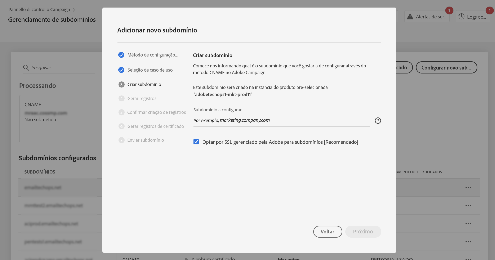
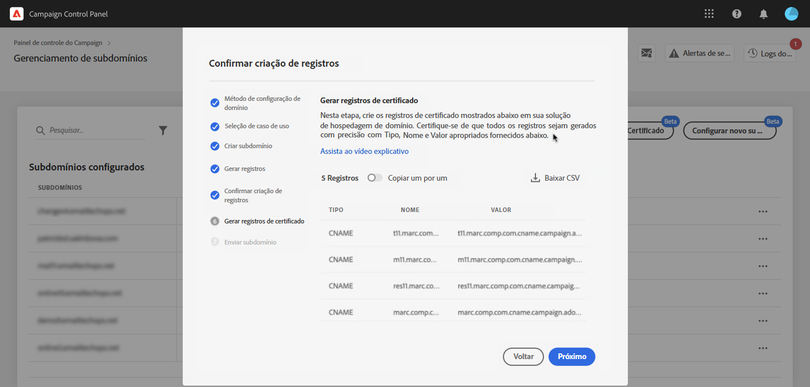
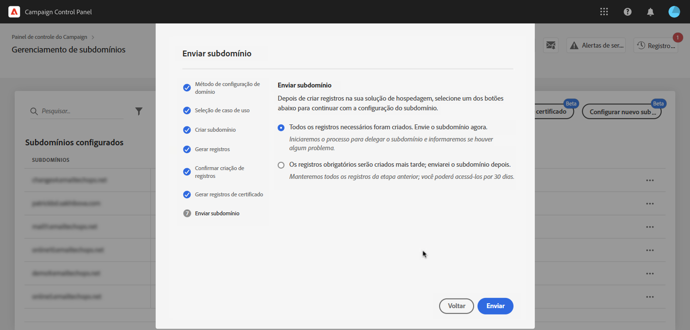

# Configurar um novo subdomínio {#setting-up-subdomain}

>[!CONTEXTUALHELP]
>id="cp_subdomain_management"
>title="Configurar novos subdomínios e gerenciar certificados"
>abstract="É necessário configurar um novo subdomínio e gerenciar os certificados SSL dos subdomínios para começar a enviar emails ou publicar páginas de destino com o Adobe Campaign."
>additional-url="https://experienceleague.adobe.com/docs/control-panel/using/subdomains-and-certificates/monitoring-ssl-certificates.html?lang=pt-BR" text="Monitorar certificados SSL"

## Leitura obrigatória {#must-read}

Esta página fornece informações sobre como configurar novos subdomínios usando a delegação de subdomínio completa ou CNAMEs. Os conceitos globais sobre esses dois métodos são apresentados nesta seção: [Marca de subdomínios](../../subdomains-certificates/using/subdomains-branding.md).

**Tópicos relacionados:**

* [Monitoramento de subdomínios](../../subdomains-certificates/using/monitoring-subdomains.md)

### Seleção da instância

A configuração de subdomínio está disponível somente para instâncias de **produção**.

Se a instância selecionada no assistente não tiver subdomínios configurados anteriormente, o primeiro subdomínio configurado se tornará o **subdomínio principalo** para essa instância e você não poderá alterá-lo no futuro. Como resultado, **registros de DNS reverso** serão criados para outros subdomínios usando esse subdomínio principal. **Endereços de resposta e de rejeição** para outros subdomínios serão gerados com base no subdomínio principal.

### Delegação de certificados SSL de subdomínios para a Adobe

Ao configurar um novo subdomínio, é possível solicitar que o certificado SSL seja gerenciado pela Adobe. Isso é altamente recomendado, pois a Adobe criará o certificado automaticamente e o renovará todos os anos antes que ele vença.

Se estiver usando CNAMEs para configurar uma delegação de subdomínio, a Adobe fornecerá registros de certificado para usar em sua solução de hospedagem de domínio e gerar seu certificado.

>[!NOTE]
>
>O SSL gerenciado pela Adobe é um recurso gratuito que está disponível para usuários. [Saiba mais sobre o gerenciamento de certificados SSL](monitoring-ssl-certificates.md#management)

### Configuração de nameserver

Ao configurar servidores de nomes, **nunca delegue o subdomínio raiz à Adobe**. Caso contrário, o domínio poderá trabalhar somente com a Adobe. Qualquer outro uso será impossível, como por exemplo, enviar emails internos aos funcionários de sua organização.

Além disso, **não crie um arquivo de zona separado** para esse novo subdomínio.

## Delegação de subdomínio completa {#full-subdomain-delegation}

>[!CONTEXTUALHELP]
>id="cp_add_new_subdomain"
>title="Adicionar novo subdomínio"
>abstract="A Adobe recomenda a delegação completa de subdomínio. No entanto, é possível usar CNAMEs ou métodos personalizados para configurar os subdomínios."
>additional-url="https://experienceleague.adobe.com/docs/control-panel/using/subdomains-and-certificates/setting-up-new-subdomain.html?lang=pt-BR" text="Configurar um novo subdomínio"
>additional-url="https://helpx.adobe.com/br/enterprise/using/support-for-experience-cloud.html" text="Entre em contato com o Atendimento ao cliente"

>[!CONTEXTUALHELP]
>id="cp_add_subdomain_create_delegate"
>title="Criar e delegar o subdomínio"
>abstract="Crie o subdomínio que você deseja usar com o Adobe Campaign na solução de hospedagem e delegue-o à Adobe."
>additional-url="https://experienceleague.adobe.com/docs/control-panel/using/subdomains-and-certificates/setting-up-new-subdomain.html?lang=pt-BR" text="Configurar um novo subdomínio"

>[!CONTEXTUALHELP]
>id="cp_add_subdomain_submit"
>title="Enviar o subdomínio"
>abstract="Confirme e envie o subdomínio que foi configurado nas etapas anteriores."
>additional-url="https://experienceleague.adobe.com/docs/control-panel/using/subdomains-and-certificates/setting-up-new-subdomain.html?lang=pt-BR" text="Configurar um novo subdomínio"

Para delegar totalmente um subdomínio ao Adobe Campaign, siga as etapas abaixo.

 Conheça este recurso no vídeo usando o [Campaign v7/v8](https://experienceleague.adobe.com/docs/campaign-classic-learn/control-panel/subdomains-and-certificates/subdomain-delegation.html?lang=pt-BR#subdomains-and-certificates) ou o [Campaign Standard](https://experienceleague.adobe.com/docs/campaign-standard-learn/control-panel/subdomains-and-certificates/subdomain-delegation.html?lang=pt-BR#subdomains-and-certificates)

1. No cartão **[!UICONTROL Subdomínios e certificados]**, selecione a instância de produção desejada e clique em **[!UICONTROL Configurar novo subdomínio]**.

   

1. Clique em **[!UICONTROL Próximo]** para confirmar o método de delegação completa.

   

1. Crie o subdomínio e os servidores de nomes desejados na solução de hospedagem usada por sua organização. Para fazer isso, copie e cole as informações do Servidor de nomes da Adobe exibidas no assistente. Para obter mais informações sobre como criar um subdomínio em uma solução de hospedagem, consulte o [vídeo tutorial](https://video.tv.adobe.com/v/30175).

   >[!NOTE]
   >
   > Para o Adobe Campaign Standard, os subdomínios delegados permitirão enviar comunicações de **Marketing** e **Transacional**.

   

1. Depois que o subdomínio for criado com as informações correspondentes do nameserver da Adobe, clique em **[!UICONTROL Próximo]**.

1. Se tiver selecionado uma instância do Campaign v7/v8, selecione o caso de uso desejado para o subdomínio: **Comunicações de marketing** ou **Comunicações transacionais e operacionais**. Os conceitos globais nos casos de uso de subdomínios são apresentados [nesta seção](../../subdomains-certificates/using/subdomains-branding.md#about-subdomains-use-cases).

   

1. Digite o subdomínio criado na sua solução de hospedagem e clique em **[!UICONTROL Enviar]**.

   Preencha o **nome completo** do subdomínio que será delegado. Por exemplo, para delegar o subdomínio &quot;usoffer.email.weretail.com&quot;, digite &quot;usoffer.email.weretail.com&quot;.

1. Para delegar a geração do certificado SSL do subdomínio à Adobe, habilite a opção **[!UICONTROL Optar por SSL gerenciado pela Adobe para subdomínios]**. [Saiba mais sobre a delegação de certificados SSL](delegate-ssl.md)

   

Depois que o subdomínio for enviado, várias verificações e etapas de configuração serão executadas pelo Painel de controle. Para obter mais informações, consulte [Verificações e configuração de subdomínio](#subdomain-checks-and-configuration).

## Configuração de subdomínio usando CNAMEs {#use-cnames}

>[!CONTEXTUALHELP]
>id="cp_add_cname_subdomain_create_delegate"
>title="Configurar o subdomínio"
>abstract="Nesta tela, especifique o subdomínio que deseja configurar usando CNAMEs."
>additional-url="https://experienceleague.adobe.com/docs/control-panel/using/subdomains-and-certificates/setting-up-new-subdomain.html?lang=pt-BR" text="Configurar um novo subdomínio"

>[!CONTEXTUALHELP]
>id="cp_add_cname_records"
>title="Gerar registros"
>abstract="Navegue até a solução de hospedagem para gerar a lista de registros DNS mostrados nessa tela."
>additional-url="https://experienceleague.adobe.com/docs/control-panel/using/subdomains-and-certificates/setting-up-new-subdomain.html?lang=pt-BR" text="Configurar um novo subdomínio"

>[!CONTEXTUALHELP]
>id="cp_add_cname_subdomain_submit"
>title="Enviar o subdomínio"
>abstract="Confirme e envie o subdomínio que foi configurado nas etapas anteriores."
>additional-url="https://experienceleague.adobe.com/docs/control-panel/using/subdomains-and-certificates/setting-up-new-subdomain.html?lang=pt-BR" text="Configurar um novo subdomínio"

Para configurar um subdomínio usando CNAMEs, siga as etapas abaixo.

 Conheça este recurso no vídeo usando o [Campaign v7/v8](https://experienceleague.adobe.com/docs/campaign-classic-learn/control-panel/subdomains-and-certificates/delegating-subdomains-using-cname.html?lang=pt-BR#subdomains-and-certificates) ou o [Campaign Standard](https://experienceleague.adobe.com/docs/campaign-standard-learn/control-panel/subdomains-and-certificates/delegating-subdomains-using-cname.html?lang=pt-BR)

1. No cartão **[!UICONTROL Subdomínios e certificados]**, selecione a instância de produção desejada e clique em **[!UICONTROL Configurar novo subdomínio]**.

   

1. Selecione o método **[!UICONTROL CNAME]** e clique em **[!UICONTROL Próximo]**.

   

1. Se tiver selecionado uma instância do Campaign v7/v8, selecione o caso de uso desejado para o subdomínio: **Comunicações de marketing** ou **Comunicações transacionais e operacionais**. Os conceitos globais nos casos de uso de subdomínios são apresentados [nesta seção](../../subdomains-certificates/using/subdomains-branding.md#about-subdomains-use-cases).

   

1. Digite o subdomínio criado na sua solução de hospedagem.

   Para delegar a geração do certificado SSL do subdomínio à Adobe, habilite a opção **[!UICONTROL Optar por SSL gerenciado pela Adobe para subdomínios]**. [Saiba mais sobre a delegação de certificados SSL](delegate-ssl.md)

   

   >[!NOTE]
   >
   >Preencha o **nome completo** do subdomínio que será configurado. Por exemplo, para configurar o subdomínio &quot;usoffers.email.weretail.com&quot;, digite &quot;usoffers.email.weretail.com&quot;.

1. A lista de registros que serão colocados em seus servidores DNS é exibida. Copie esses registros, um por um ou baixando um arquivo CSV, e navegue até a solução de hospedagem de domínio para gerar os registros DNS correspondentes.

   

1. Certifique-se de que todos os registros DNS das etapas anteriores tenham sido gerados em sua solução de hospedagem de domínio. Se tudo estiver configurado corretamente, selecione a primeira instrução e clique em **[!UICONTROL Próximo]** para confirmar.

   Se desejar criar os registros e enviar a configuração de subdomínio posteriormente, selecione a segunda instrução. Será possível retomar a configuração do subdomínio diretamente a partir da área **[!UICONTROL Processamento]** da tela de gerenciamento de subdomínios. Observe que os registros DNS que serão colocados em seu servidor serão mantidos pelo Painel de controle por 30 dias. Após esse período, será necessário configurar o subdomínio do zero.

   >[!NOTE]
   >
   >Se tiver optado por não delegar o certificado SSL à Adobe, esta será a última etapa da configuração do subdomínio. Clique no botão **[!UICONTROL Enviar]**.

   

1. Se optar por delegar o certificado do subdomínio à Adobe, os registros do certificado serão gerados automaticamente. Copie esses registros um por um ou baixando um arquivo CSV e navegue até a sua solução de hospedagem de domínio para gerar o certificado correspondente.

   

1. Certifique-se de que todos os registros de certificado tenham sido gerados em sua solução de hospedagem de domínio. Se tudo estiver configurado corretamente, selecione a primeira instrução e clique em **[!UICONTROL Enviar]** para confirmar.

   

Depois que o subdomínio for enviado, várias verificações e etapas de configuração serão executadas pelo Painel de controle. Para obter mais informações, consulte [Verificações e configuração de subdomínio](#subdomain-checks-and-configuration).

## Verificações e configuração de subdomínio {#subdomain-checks-and-configuration}

1. Depois que o subdomínio for enviado, o Painel de controle verificará se ele aponta corretamente para os registros Adobe NS e se o registro SOA (Start of Authority, Início de Autoridade) não existe para esse subdomínio.

   >[!NOTE]
   >
   >Observe que, enquanto a configuração do subdomínio estiver em execução, outras solicitações por meio do painel de controle serão colocadas em uma fila e executadas somente após a conclusão da configuração de subdomínio, a fim de evitar problemas de desempenho.

1. Se as verificações forem bem-sucedidas, o Painel de controle começará a configurar o subdomínio com registros DNS, URLs adicionais, caixas de entrada, etc.

   

   Para mais detalhes sobre o progresso da configuração, clique no botão **[!UICONTROL Detalhes]** da configuração do subdomínio.

   

1. Por fim, a **Equipe de capacidade de entrega** será notificada sobre o novo subdomínio para fazer a auditoria. O processo de auditoria pode demorar até 10 dias úteis após a configuração do subdomínio.

   >[!IMPORTANT]
   >
   >As verificações de capacidade de entrega realizadas incluem loops de feedback e testes de loops de reclamação de spam. Portanto, não recomendamos a utilização do subdomínio antes da conclusão da auditoria, uma vez que poderá resultar em má reputação do subdomínio.
   >
   >No entanto, observe que é possível executar operações relacionadas aos certificados SSL no seu subdomínio, mesmo que a auditoria de capacidade de entrega ainda esteja em processamento.

1. No final do processo, os subdomínios serão configurados para funcionar com a instância do Adobe Campaign e os elementos abaixo serão criados:

   * **O subdomínio com os seguintes registros DNS**: SOA, MX, CNAME(s), DKIM, SPF, TXT,
   * **Subdomínios adicionais** para hospedar mirror, recursos, páginas de rastreamento e chave de domínio,
   * **Caixas de entrada**: Remetente, Erro, Responder para.

   Por padrão, a caixa de entrada &quot;Responder para&quot; no Painel de controle está configurada para apagar emails e não é revisável. Se quiser monitorar a caixa de entrada “Responder para” para suas campanhas de marketing, não use este endereço.

Para mais detalhes do subdomínio, clique nos botões **[!UICONTROL Detalhes do subdomínio]** e **[!UICONTROL Informações do remetente]**.

## Solução de problemas {#troubleshooting}

* Em alguns casos, a configuração prossegue, mas o subdomínio pode não ser verificado com sucesso. O subdomínio permanecerá na lista **[!UICONTROL Configurados]** com um log de processo que fornece informações sobre o erro. Entre em contato com o Atendimento ao cliente se tiver dificuldades para resolver o problema.
* Se o subdomínio estiver sendo exibido como “Não verificado” após a configuração, inicie uma nova verificação de subdomínio (**...** / **[!UICONTROL Verificar subdomínio]**). Se ainda mostrar o mesmo status, o motivo pode ser que haja alguma personalização feita no schema de recipients, que não pode ser verificada usando processos padrão. Tente enviar uma campanha com esse subdomínio.
* Se a configuração do subdomínio estiver demorando muito (mais de 10 dias úteis) na etapa de auditoria de entrega, entre em contato com o Atendimento ao cliente.
