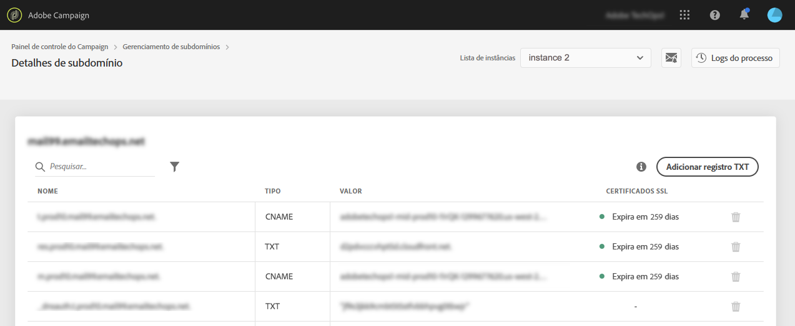

# Configurar um novo subdomínio {#setting-up-subdomain}

>[!CONTEXTUALHELP]
>id="cp_subdomain_management"
>title="Configurar novos subdomínios e gerenciar certificados"
>abstract="É necessário configurar um novo subdomínio e gerenciar os certificados SSL dos subdomínios para iniciar a enviar emails ou publicar páginas de aterrissagem com o Adobe Campaign."
>additional-url="https://docs.adobe.com/content/help/pt-BR/control-panel/using/subdomains-and-certificates/monitoring-ssl-certificates.html" text="Como monitorar os certificados SSL de subdomínios"

## Leitura obrigatória {#must-read}

>[!IMPORTANT]
>
>A delegação de subdomínios pelo Painel de controle do Campaign está disponível em beta e está sujeita a atualizações e modificações frequentes sem aviso prévio.

Esta página fornece informações sobre como configurar novos subdomínios usando a delegação de subdomínio completa ou CNAMEs. Os conceitos globais sobre esses dois métodos são apresentados nesta seção: [Marca de subdomínios](../../subdomains-certificates/using/subdomains-branding.md).

**Tópicos relacionados:**

* [Monitoramento de subdomínios](../../subdomains-certificates/using/monitoring-subdomains.md)

### Seleção da instância

A configuração de subdomínio está disponível somente para instâncias de **produção**.

Se a instância selecionada no assistente não tiver subdomínios configurados anteriormente, o primeiro subdomínio configurado se tornará o **subdomínio primário** para essa instância e você não poderá alterá-lo no futuro.

Como resultado, **registros de DNS reverso** serão criados para outros subdomínios usando esse subdomínio principal. **Endereços de resposta e de rejeição** para outros subdomínios serão gerados com base no subdomínio principal.

### Configuração de nameserver

Ao configurar servidores de nomes, **nunca delegue o subdomínio raiz à Adobe**. Caso contrário, o domínio poderá trabalhar somente com a Adobe. Qualquer outro uso será impossível, como por exemplo, enviar emails internos aos funcionários de sua organização.

Além disso, **não crie um arquivo de zona separado** para esse novo subdomínio.

## Delegação de subdomínio completa {#full-subdomain-delegation}

Para delegar totalmente um subdomínio ao Adobe Campaign, siga as etapas abaixo.

 Descubra este recurso no vídeo usando o [Campaign Classic](https://experienceleague.adobe.com/docs/campaign-classic-learn/control-panel/subdomains-and-certificates/subdomain-delegation.html?lang=pt-BR#subdomains-and-certificates) ou o [Campaign Standard](https://experienceleague.adobe.com/docs/campaign-standard-learn/control-panel/subdomains-and-certificates/subdomain-delegation.html?lang=pt-BR#subdomains-and-certificates)

1. No cartão **[!UICONTROL Subdomains & Certificates]**, selecione a instância de produção desejada e clique em **[!UICONTROL Setup new subdomain]**.

   

1. Clique em **[!UICONTROL Next]** para confirmar o método de delegação completa.

   

1. Crie o subdomínio e os servidores de nomes desejados na solução de hospedagem usada por sua organização. Para fazer isso, copie e cole as informações do Servidor de nomes da Adobe exibidas no assistente. Para obter mais informações sobre como criar um subdomínio em uma solução de hospedagem, consulte o [vídeo tutorial](https://video.tv.adobe.com/v/30175).

   >[!NOTE]
   >
   > Para o Adobe Campaign Standard, os subdomínios delegados permitirão enviar comunicações **Marketing** e **Transactional**.

   

1. Depois que o subdomínio for criado com as informações correspondentes do nameserver da Adobe, clique em **[!UICONTROL Next]**.

1. Se você selecionou uma instância do Campaign Classic, selecione o caso de uso desejado para o subdomínio: **Comunicações de marketing** ou **Comunicações transacionais e operacionais**. Os conceitos globais nos casos de uso de subdomínios são apresentados [nesta seção](../../subdomains-certificates/using/subdomains-branding.md#about-subdomains-use-cases).

   

1. Digite o subdomínio que você criou na solução de hospedagem e clique em **[!UICONTROL Submit]**.

   Preencha o **nome completo** do subdomínio que será delegado. Por exemplo, para delegar o subdomínio &quot;usoffer.email.weretail.com&quot;, digite &quot;usoffer.email.weretail.com&quot;.

   

Depois que o subdomínio for enviado, várias verificações e etapas de configuração serão executadas pelo Painel de controle do Campaign. Para obter mais informações, consulte [Verificações e configuração de subdomínio](#subdomain-checks-and-configuration).

## Configuração de subdomínio usando CNAMEs {#use-cnames}

Para configurar um subdomínio usando CNAMEs, siga as etapas abaixo.

 Descubra este recurso no vídeo usando o [Campaign Classic](https://experienceleague.adobe.com/docs/campaign-classic-learn/control-panel/subdomains-and-certificates/delegating-subdomains-using-cname.html?lang=pt-BR#subdomains-and-certificates) ou o [Campaign Standard](https://experienceleague.adobe.com/docs/campaign-standard-learn/control-panel/subdomains-and-certificates/delegating-subdomains-using-cname.html?lang=pt-BR)

1. No cartão **[!UICONTROL Subdomains & Certificates]**, selecione a instância de produção desejada e clique em **[!UICONTROL Setup new subdomain]**.

   

1. Selecione o método **[!UICONTROL CNAME]** e clique em **[!UICONTROL Next]**.

   

1. Se você selecionou uma instância do Campaign Classic, selecione o caso de uso desejado para o subdomínio: **Comunicações de marketing** ou **Comunicações transacionais e operacionais**. Os conceitos globais nos casos de uso de subdomínios são apresentados [nesta seção](../../subdomains-certificates/using/subdomains-branding.md#about-subdomains-use-cases).

   

1. Digite o subdomínio que você criou na solução de hospedagem e clique em **[!UICONTROL Next]**.

   Preencha o **nome completo** do subdomínio que será configurado. Por exemplo, para configurar o subdomínio &quot;usoffers.email.weretail.com&quot;, digite &quot;usoffers.email.weretail.com&quot;.

   

1. A lista de registros que serão colocados em seus servidores DNS é exibida. Copie esses registros, um por um ou baixando um arquivo CSV, e navegue até a solução de hospedagem de domínio para gerar os registros DNS correspondentes.

   

1. Certifique-se de que todos os registros DNS das etapas anteriores tenham sido gerados em sua solução de hospedagem de domínio. Se tudo estiver configurado corretamente, selecione a primeira instrução e clique em **[!UICONTROL Submit]** para confirmar.

   

   >[!NOTE]
   >
   >Se desejar criar os registros e enviar a configuração de subdomínio posteriormente, selecione a segunda instrução e clique em **[!UICONTROL Submit later]**. Você poderá retomar a configuração do subdomínio diretamente da área da tela de gerenciamento de subdomínio **[!UICONTROL Processing]**.
   >
   >Observe que os registros DNS que serão colocados em seu servidor serão mantidos pelo Painel de controle do Campaign por 30 dias. Após esse período, será necessário configurar o subdomínio do zero.

Depois que o subdomínio for enviado, várias verificações e etapas de configuração serão executadas pelo Painel de controle do Campaign. Para obter mais informações, consulte [Verificações e configuração de subdomínio](#subdomain-checks-and-configuration).

## Verificações e configuração de subdomínio {#subdomain-checks-and-configuration}

1. Depois que o subdomínio for enviado, o Painel de controle do Campaign verificará se ele aponta corretamente para os registros Adobe NS e se o registro de SOA (Start of Authority, Início de Autoridade) não existe para esse subdomínio.

   >[!NOTE]
   >
   >Observe que enquanto a configuração de subdomínio for executada, outras solicitações por meio do Painel de controle do Campaign serão colocadas em uma fila e executadas somente após a conclusão da configuração de subdomínio, para evitar problemas de desempenho.

1. Se as verificações forem bem-sucedidas, o Painel de controle do Campaign começará a configurar o subdomínio com registros DNS, URLs adicionais, caixas de entrada etc.

   

   Para obter mais detalhes sobre o progresso da configuração, clique no botão de configuração de subdomínio **[!UICONTROL Details]**.

   

1. Por fim, a **Equipe de avaliação do delivery** será notificada sobre o novo subdomínio para fazer a auditoria. O processo de auditoria pode demorar até 10 dias úteis após a configuração do subdomínio.

   >[!IMPORTANT]
   >
   >As verificações de capacidade de delivery realizadas incluem loops de feedback e testes de loops de reclamação de spam. Portanto, não recomendamos a utilização do subdomínio antes da conclusão da auditoria, uma vez que poderá resultar em má reputação do subdomínio.

1. No final do processo, os subdomínios serão configurados para funcionar com a instância do Adobe Campaign e os elementos abaixo serão criados:

   * **O subdomínio com os seguintes registros DNS**: SOA, MX, CNAME(s), DKIM, SPF, TXT,
   * **Subdomínios adicionais** para hospedar mirror, recursos, páginas de rastreamento e chave de domínio,
   * **Caixas de entrada**: Remetente, Erro, Responder para.

   Por padrão, a caixa de entrada &quot;Responder para&quot; no Painel de controle do Campaign está configurada para apagar emails e não é revisável. Se quiser monitorar a caixa de entrada “Responder para” para suas campanhas de marketing, não use este endereço.

Para obter mais detalhes sobre o subdomínio, clique nos botões **[!UICONTROL Subdomain details]** e **[!UICONTROL Sender info]**.

## Solução de problemas {#troubleshooting}

* Em alguns casos, a configuração prossegue, mas o subdomínio pode não ser verificado com êxito. O subdomínio permanecerá na **[!UICONTROL Configured]** lista com um log de trabalho que fornece informações sobre o erro. Entre em contato com o Atendimento ao cliente se tiver dificuldades para resolver o problema.
* Se o subdomínio estiver sendo exibido como &quot;Não verificado&quot; após a configuração, inicie uma nova verificação de subdomínio (**...** / **[!UICONTROL Verify subdomain]**). Se ainda mostrar o mesmo status, o motivo pode ser que haja alguma personalização feita no schema de recipients, que não pode ser verificada usando processos padrão. Tente enviar uma campanha com esse subdomínio.
* Se a configuração do subdomínio estiver demorando muito (mais de 10 dias úteis) na etapa de auditoria de entrega, entre em contato com o Atendimento ao cliente.
